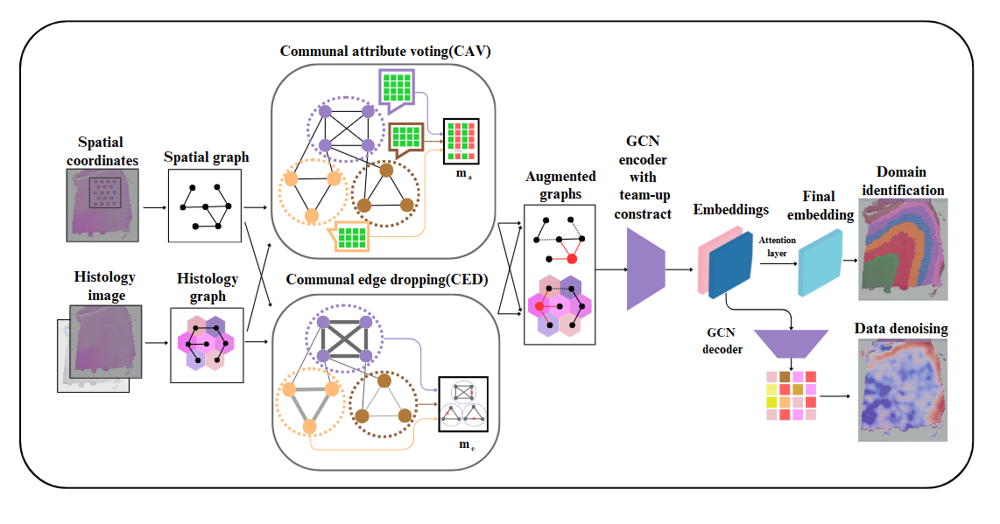

# CSA

## Overview
CSA is a tool for spatial domain clustering and gene expression denoising of spatial resolved transcriptomics (ST) data. CSA constructs graphs based on spatial coordinates and histology images, respectively. Next, CSA generates two augmented views based on community strength on each graph. A graph convolutional network is used as an encoder to learn the low-dimensional embedding of each view. These embeddings are then adaptively integrated by an attention layer to obtain the final latent embedding, which is used in downstream analysis such as spatial domain identification and expression denoising.

## Tutorials
See in [Documentation and Tutorials](https://csa-docs.readthedocs.io/en/latest/).

## Software dependencies
scanpy

Pytorch==2.0.1

## install

cd CSA-main

python setup.py build

python setup.py install
